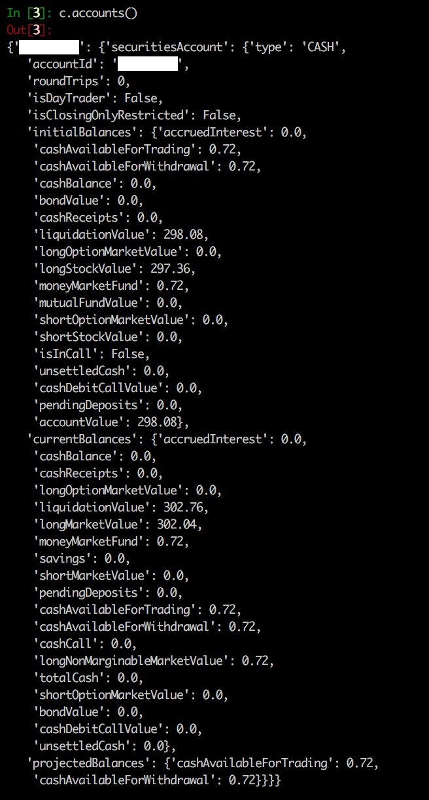

===============
Getting started
===============
.. WARNING:: tdameritrade is under active beta development, so interfaces and functionality may change

Overview
===============

TDClient object
---------------
The API works with a ``TDClient`` object:

Accounts
~~~~~~~~~

.. code:: python3

    from tdameritrade import TDClient
    c = TDClient(<TOKEN>)
    c.accounts()

Search for symbols
~~~~~~~~~~~~~~~~~~

.. code:: python3

    c.search('aapl')

Quotes
~~~~~~~~~~~~~~~~~~

.. code:: python3

    c.quote('aapl')

Instrument
~~~~~~~~~~~~~~~~~~

.. code:: python3

    c.instrument('aapl')

History
~~~~~~~~~~~~~~~~~~

.. code:: python3

    c.history('aapl')

Option Chain
~~~~~~~~~~~~~~~~~~

.. code:: python3

    c.options('aapl')
